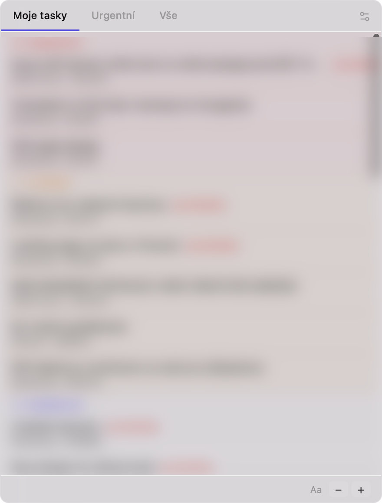

# Redmine Focus

macOS tray aplikace, která zobrazuje vaše Redmine úkoly přímo v menu baru. Navržená pro vývojáře a projektové manažery, kteří potřebují mít přehled o svých úkolech bez nutnosti otevírat prohlížeč.

  

---

## Funkce

### Přehled úkolů
- **Taby** — tři pohledy: *Moje tasky* (přiřazené přihlášenému uživateli), *Urgentní* (priority Urgent/High), *Vše*
- **Seskupení dle priority** — úkoly jsou seřazeny do barevně odlišených skupin (Urgentní → Vysoká → Normální → Nízká)
- **Termíny** — zobrazení deadline u každého úkolu, červeně zvýrazněné při blížícím se termínu
- **Automatické obnovení** — polling na pozadí, data se pravidelně aktualizují

### Detail úkolu
- Slide-in panel s popisem renderovaným jako **Markdown** (headingy, listy, kód, tučný text)
- Tlačítko **Vyřeším** — uzavře úkol přesunem do prvního dostupného uzavíracího stavu
- Tlačítko **Pracuji** — nastaví nakonfigurovaný "in-progress" stav
- Tlačítko **Předat** — dropdown se členy projektu pro rychlé přeřazení
- **Přidat komentář** — textarea pro rychlé přidání poznámky přímo z aplikace

### Rychlé akce
- **Hover ikony** na každém úkolu v seznamu — bez nutnosti otevírat detail
  - ▶ nastaví úkol jako "v práci" (nebo otevře nastavení, pokud stav není nakonfigurován)
  - ✓ okamžitě uzavře úkol

### Přizpůsobení
- **Workflow** — nastavení stavu "v práci" (auto-detekce z dostupných stavů Redmine)
- **Velikost písma** — nastavitelná v patičce (Aa − / +), rozsah 12–18 px, uloženo mezi restarty
- **Nastavení** — Redmine URL, API klíč, interval pollingu, filtrování dle projektu

### Bezpečnost
- **API klíč v macOS Keychain** — uložen v systémovém Keychain, ne v JSON souboru
- **Notarizace Apple** — appka je podepsána a notarizována, Gatekeeper ji akceptuje bez varování

### macOS integrace
- Tray ikona s podporou **light/dark mode** (macOS template image)
- **Vibrancy efekt** (HudWindow) — průhledné pozadí s blur efektem
- Okno se schová po kliknutí jinam, znovu otevře kliknutím na tray ikonu

---

## Screenshot



---

## Požadavky

- macOS 12+ (Apple Silicon nebo Intel)
- Redmine instance s přístupem přes REST API
- API klíč (Redmine → Můj účet → API přístupový klíč)

---

## Instalace

1. Stáhněte `.dmg` ze sekce [Releases](../../releases)
2. Přetáhněte **Redmine Focus.app** do složky Aplikace
3. Spusťte aplikaci — tray ikona se objeví v menu baru
4. Klikněte na ikonu → nastavte Redmine URL a API klíč

---

## Vývoj

### Prerekvizity

- [Node.js](https://nodejs.org/) 18+
- [Rust](https://rustup.rs/) (stable)
- Xcode Command Line Tools

### Spuštění

```bash
npm install
npm run tauri dev
```

> Dev build má omezení vibrancy efektu — pro testování UI použijte release build.

### Release build

```bash
export PATH="$PATH:~/.cargo/bin"
npm run tauri build
```

Výstup: `src-tauri/target/release/bundle/dmg/Redmine Focus_0.1.0_aarch64.dmg`

### Testy

```bash
npx vitest run      # frontend testy
npx tsc --noEmit    # TypeScript kontrola
```

---

## Architektura

```
redmine-focus/
├── src/                        # React frontend (TypeScript)
│   ├── components/
│   │   ├── Tabs.tsx            # Horní lišta s taby
│   │   ├── TaskList.tsx        # Seznam úkolů seskupených dle priority
│   │   ├── TaskItem.tsx        # Jeden řádek úkolu
│   │   ├── TaskDetail.tsx      # Slide-in detail panel
│   │   └── Settings.tsx        # Nastavení
│   ├── store/
│   │   ├── tasks.ts            # Zustand store – issues, projekty, aktivní tab
│   │   └── config.ts           # Zustand store – konfigurace
│   ├── types.ts                # Sdílené TypeScript typy
│   └── index.css               # Kompletní styling s CSS proměnnými
└── src-tauri/                  # Rust backend (Tauri 2)
    ├── src/
    │   ├── main.rs             # Okno, tray, lifecycle
    │   ├── commands.rs         # Tauri commands (invoke handlers)
    │   ├── poller.rs           # Polling service
    │   ├── redmine.rs          # Redmine REST API klient
    │   └── store.rs            # Perzistence konfigurace
    └── icons/
        ├── icon.svg            # Master app ikona (indigo, Linear styl)
        └── tray-icon.png       # Monochromatická tray ikona (template image)
```

### Tech stack

| Vrstva | Technologie |
|--------|-------------|
| Framework | Tauri 2 |
| Frontend | React 18 + TypeScript + Vite |
| State | Zustand |
| UI ikony | lucide-react |
| Backend | Rust (tokio, reqwest, serde) |
| Persistence | tauri-plugin-store + macOS Keychain (keyring) |
| Testy | Vitest + Testing Library |

---

## Redmine API

Aplikace komunikuje s těmito endpointy:

| Endpoint | Použití |
|----------|---------|
| `GET /issues.json?assigned_to_id=me&status_id=open` | Načtení issues |
| `GET /projects.json` | Načtení projektů |
| `GET /issues/:id.json?include=journals` | Detail úkolu |
| `GET /issue_statuses.json` | Dostupné stavy |
| `GET /projects/:id/memberships.json` | Členové projektu |
| `PUT /issues/:id.json` | Aktualizace úkolu (stav, přiřazení, komentář) |

---

## Licence

MIT
